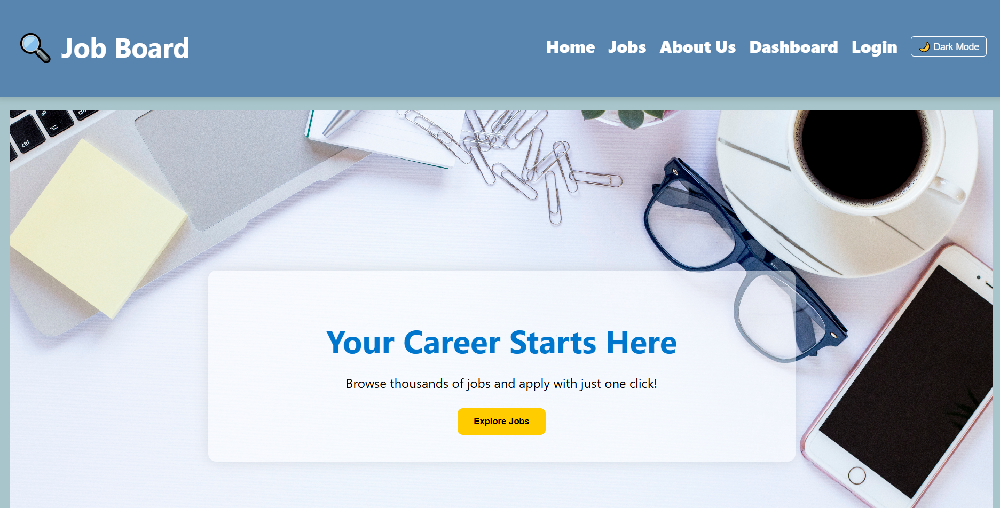
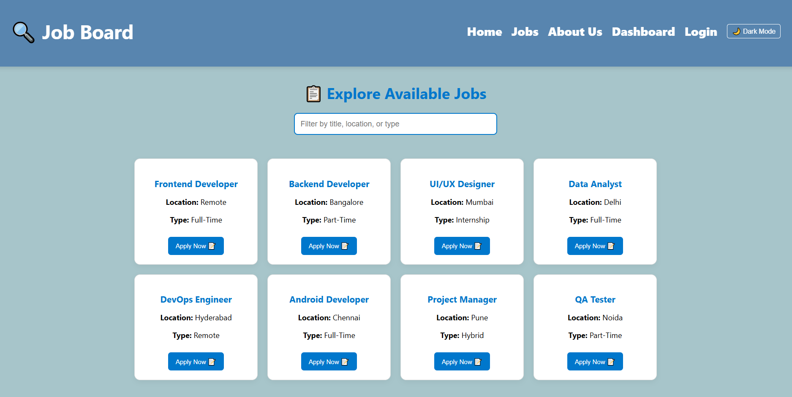
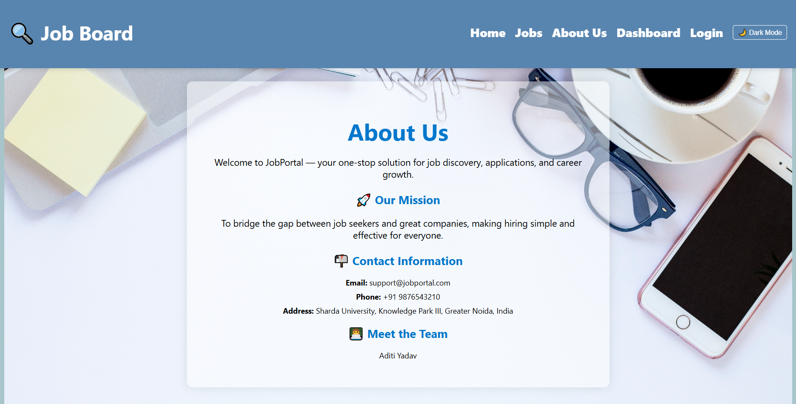
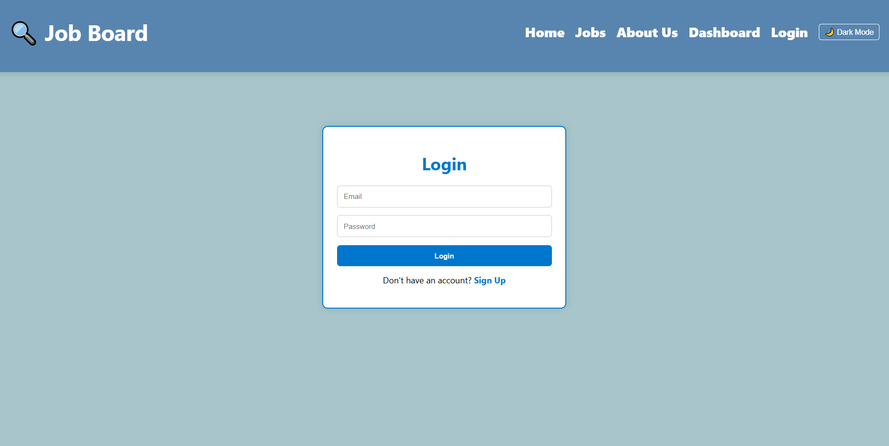
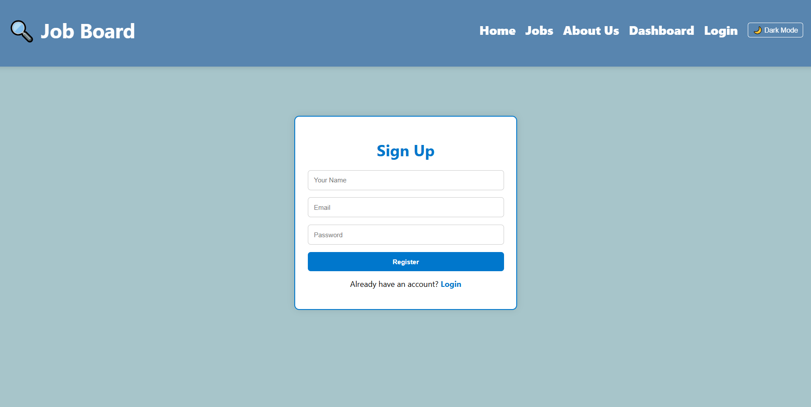

# 💼 Job Board Portal

A fully responsive and user-friendly **Job Board Web Application** built with React.js, CSS, and React Router. This platform allows users to explore jobs, apply with resumes, and manage profiles. Admins can manage job postings and applications.

---

## Watch it live:-
job-board-git-main-aditi-yadavs-projects-3dd6b72c.vercel.app

---

## 🚀 Features

- **🔍 Explore Jobs** – Browse and filter jobs by title, location, or type.
- **📝 Apply Online** – Apply to jobs with resume upload and short statement.
- **🔐 User Auth System** – Login/Signup with session handling using React Context.
- **👤 User Dashboard** – View your applications and profile.
- **🛠️ Admin Dashboard** – Post new jobs and view all applications (admin access only).
- **🌗 Light/Dark Mode Toggle** – Theme toggle for a better user experience.
- **📱 Fully Responsive UI** – Mobile-first, adaptive layout.
- **📦 React Router** – Seamless client-side routing.

---

## 📁 Project Structure

job_board/
├── public/
│   └── index.html
├── src/
│   ├── assets/      # Backgrounds, logos
│   ├── components/  # Navbar, Header, JobCard, Footer, etc.
│   ├── pages/       # Home, Jobs, Login, Signup, Dashboard, About
│   ├── context/     # AuthContext
│   ├── App.js
│   ├── index.js
│   └── index.css
├── .gitignore
├── package.json
└── README.md 

---

### 🖥️ Welcome Screen

### 📌 Pages

### 📌 Admin LogIn / SignUp

---

## 💻 Tech Stack

- **React.js** – Component-based SPA
- **CSS3** – Custom styling
- **React Router DOM** – Page navigation
- **Git & GitHub** – Version control and hosting

---

## 🧠 How it works?

- **Home** – Intro and CTA for exploring jobs.
- **Jobs** – Search, filter, and apply to jobs.
- **Apply** – Fill name, email, reason, and upload resume.
- **Dashboard** – View your applied jobs.
- **Admin?** – Use admin@admin.com to login and manage postings.
- **Dark Mode** – Toggle with ☀️/🌙 button.

---

## 👩‍💼 Admin Credentials (For Testing)

- **Email:** admin@admin.com
- **Password:** any (mock system)
